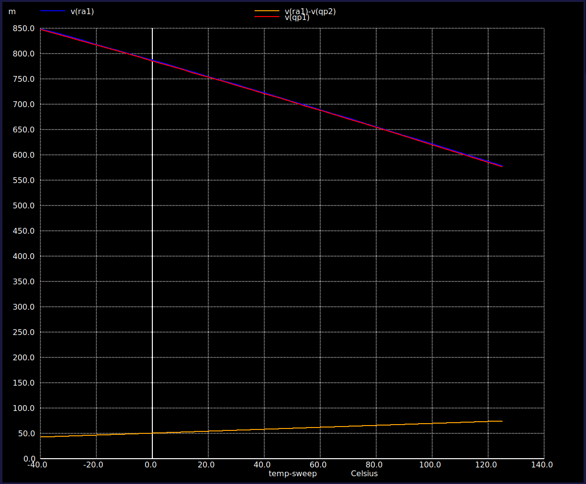
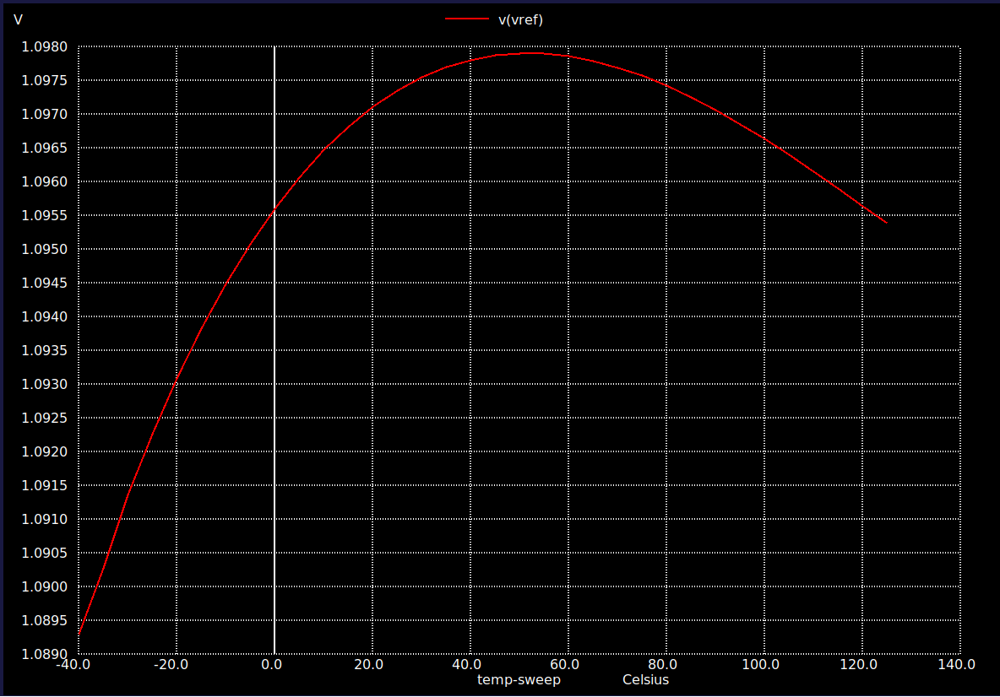
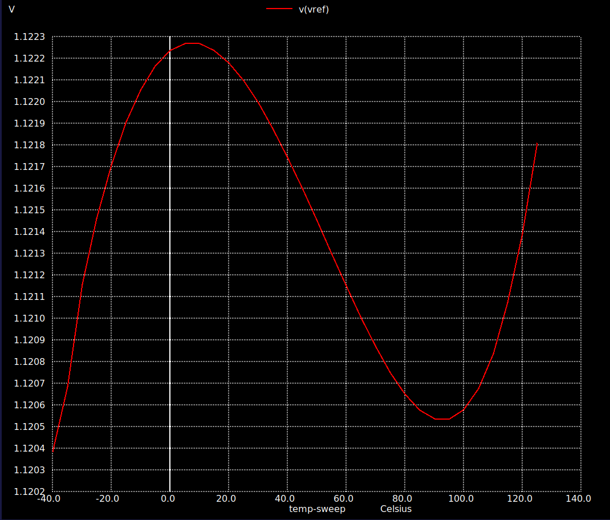
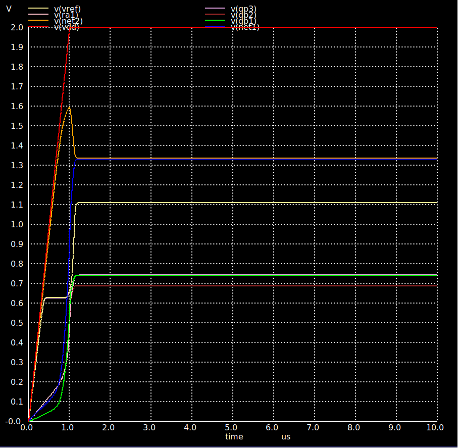
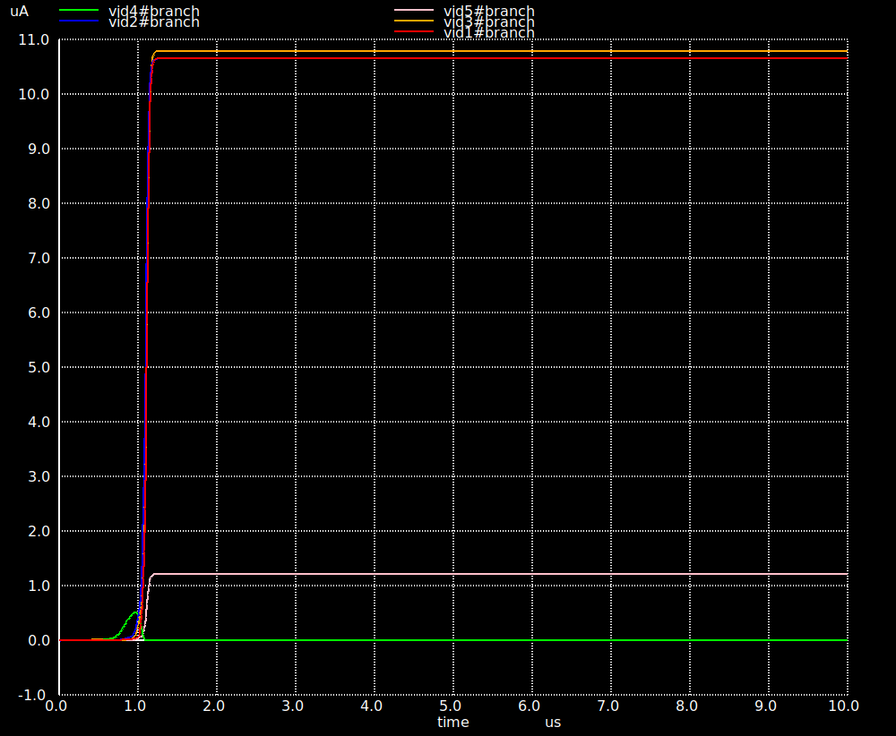

# Workshop Spice Simulation Results

## CTAT Spice simulations

|  |
|:----------------------:|
| *Figure 1: CTAT circuit. [Spice Netlist](../SpiceNetlists/CTAT_Circuit/ctat_circuit_sim.sp).* |

|  |
|:----------------------:|
| *Figure 1: CTAT voltage w.r.t temperature. [Spice Netlist](../SpiceNetlists/CTAT_Circuit/ctat_circuit_sim.sp).* |
* The temp coefficient of CTAT = -1.75228mV/degC

|  |
|:----------------------:|
| *Figure 2: CTAT voltage w.r.t temperature with 8  parallel device. [Spice Netlist](../SpiceNetlists/CTAT_Circuit/ctat_circuit_sim_nrdevices.sp).* |
* The temp coefficient can be seen to become negative to -1.91658mV/degC since more temp dependent devices are added to the circuit.

|  |
|:----------------------:|
| *Figure 3: CTAT voltage w.r.t temperature and load current. [Spice Netlist](../SpiceNetlists/CTAT_Circuit/ctat_circuit_sim_load.sp).* |
* The temp coefficient can be seen to become less negative with increase in the branch current. This because higher branch current => higher Vbe => dVctat/dT gets higher see [CTAT_Equation](../../CTAT_Equation_Derivation.pdf). 

## PTAT Spice simulations

|  |
|:----------------------:|
| *Figure 4: PTAT circuit. [Spice Netlist](../SpiceNetlists/PTAT_Circuit/ptat_circuit.sp)* |

|  |
|:----------------------:|
| *Figure 5: V(qp1) & V(ra1) w.r.t temperature of the PTAT circuit. [Spice Netlist](../SpiceNetlists/PTAT_Circuit/ptat_circuit.sp)* |
* It can be seen that both qp1 and ra1 have the same nodal voltages. This is because the high gain OP-AMP's input terminals are acting as a nullator to create a virtual short between qp1 and ra1.
* Node qp1 is actually a CTAT element in the PTAT circuit. We can therefore see a -ve temp coefficient in the above figure. 

|  |
|:----------------------:|
| *Figure 6: V(ra1)-V(qp2) w.r.t temperature i.e. the PTAT voltage in the PTAT circuit. [Spice Netlist](../SpiceNetlists/PTAT_Circuit/ptat_circuit.sp)* |
* The desired +ve temp coefficient, i.e., the +ve slope of the curve, can be seen in the above figure.

|  |
|:----------------------:|
| *Figure 7: V(qp1) & V(ra1) & V(ra1)-V(qp2) w.r.t temperature of the PTAT circuit. [Spice Netlist](../SpiceNetlists/PTAT_Circuit/ptat_circuit.sp)* |

|  |
|:----------------------:|
| *Figure 8: Id1 & Id2 w.r.t temperature of the PTAT circuit. [Spice Netlist](../SpiceNetlists/PTAT_Circuit/ptat_circuit.sp)* |
* As shown in the figure, the branch current is =
* This is because the R1 is chosen to be 5kohms => I = Vt*ln(N)/R1 with N = 8 => I = 10uA. The simulation also matches our calculation.

## BGR with ideal OP-AMP Spice simulation

|  |
|:----------------------:|
| *Figure 9: BGR using an ideal opamp circuit. [Spice Netlist](../SpiceNetlists/BGR_using_ideal_OPAMP/bgr_using_ideal_opamp.sp)* |

|  |
|:----------------------:|
| *Figure 10: BGR voltage given by the BGR circuit. [Spice Netlist](../SpiceNetlists/BGR_using_ideal_OPAMP/bgr_using_ideal_opamp.sp)* |
* It can be seen that across the whole temperature range, the BGR voltage changes by only about 4mV from -40degC to 125degC 

|  |
|:----------------------:|
| *Figure 11: V(vref)-V(qp3) & V(ra1) w.r.t temperature, i.e., the PTAT voltage and PTAT voltage before the 9x gain by R2 & R1. [Spice Netlist](../SpiceNetlists/BGR_using_ideal_OPAMP/bgr_using_ideal_opamp.sp)* |
* The desired +ve temp coefficient, i.e., the +ve slope of the curve, can be seen again in the above figure.
* It can be seen before the gain of x9, the temp coefficient is 0.186211mV/degC and after gain its 1.64897mV/degC i.e. apporx x9 increase.
* With this gain the PTAT +ve temp coefficient is close to the CTAT's -ve temp coefficient.

|  |
|:----------------------:|
| *Figure 12: V(qp3) w.r.t temperature, i.e., the CTAT voltage in the BGR circuit. [Spice Netlist](../SpiceNetlists/BGR_using_ideal_OPAMP/bgr_using_ideal_opamp.sp)* |
* The desired -ve temp coefficient of -1.65194mV/degC, identical to the previous CTAT simulation, can be seen again in the above figure.

|  |
|:----------------------:|
| *Figure 13: Id1, Id2 & Id3 w.r.t temperature, i.e., the branch currents in the BGR circuit. [Spice Netlist](../SpiceNetlists/BGR_using_ideal_OPAMP/bgr_using_ideal_opamp.sp)* |
* The branch currents are again close to what was calculated.

|  |
|:----------------------:|
| *Figure 14: BGR, PTAT & CTAT voltages w.r.t temperature. [Spice Netlist](../SpiceNetlists/BGR_using_ideal_OPAMP/bgr_using_ideal_opamp.sp)* |
* BGR is shown in orange color, PTAT is shown blue color and CTAT is shown in red color.

## BGR Spice simulation

|  |
|:----------------------:|
| *Figure 15: BGR. [Spice Netlist](../SpiceNetlists/BGR/bgr.sp)* |

|  |
|:----------------------:|
| *Figure 16: BGR typical corner V(vref) simulation. [Spice Netlist](../SpiceNetlists/BGR/bgr.sp)* |
* From the above image, it can be seen that in the temperature range of -40degC(Tmin) to 125degC(Tmax), we see a Vmax = 1.1100V at about 27degC & Vmin = 1.10575V at about -40degC => uV/degC = $\frac{Vmax-Vmin}{Tmax-Tmin}$ = $\frac{1.1100-1.10575}{125-(-40)}$ = 25.75uV/degC
* From the above figure, Vmean = 1.10775V =>ppm/degC = $\frac{Vmax-Vmin}{Vmean} * 10^6 * \frac{1}{Tmax-Tmin}$ = $\frac{1.1100-1.10575}{1.10775}* 10^6 * \frac{1}{125-(-40)}$ = 23.5215ppm/degC

|  |
|:----------------------:|
| *Figure 17: BGR slow corner V(vref) simulation. [Spice Netlist](../SpiceNetlists/BGR/bgr.sp)* |
* From the above image,

|  |
|:----------------------:|
| *Figure 18: BGR fast corner V(vref) simulation. [Spice Netlist](../SpiceNetlists/BGR/bgr.sp)* |
* From the above image,

|  |
|:----------------------:|
| *Figure 19: BGR node voltages V(net1), V(net2), V(net6), V(qp1), V(vdd), V(vref). [Spice Netlist](../SpiceNetlists/BGR/bgr_startup.sp)* |
* Details about how nodal voltages follow the supply and stuff

|  |
|:----------------------:|
| *Figure 20: BGR node/branch currents id1 (CTAT branch), id2 (PTAT branch), id3(Ref branch), id4(Current injector branch), id5(start-up branch). [Spice Netlist](../SpiceNetlists/BGR/bgr_startup.sp)* |
* Details about how nodal currents follows the supply and stuff

