# Workshop Spice Simulation Results

## CTAT Spice simulations

|  |
|:----------------------:|
| *Figure 1: CTAT voltage w.r.t temperature. [Spice Netlist](../SpiceNetlists/CTAT_Circuit/ctat_circuit_sim.sp).* |

| 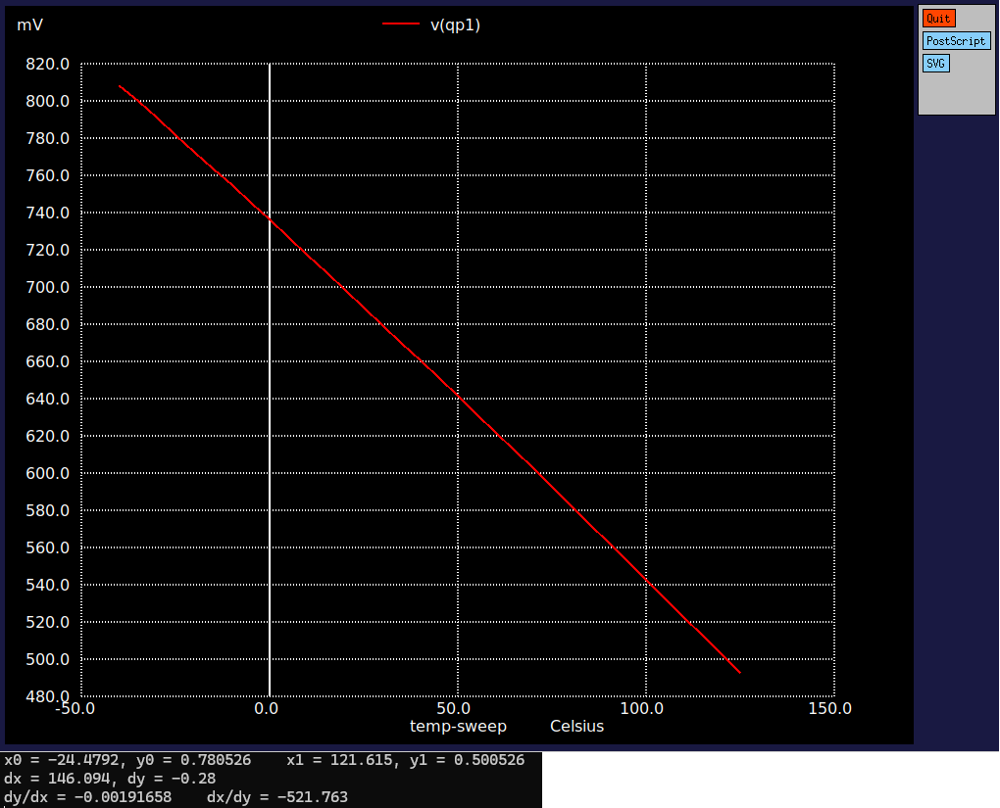 |
|:----------------------:|
| *Figure 2: CTAT voltage w.r.t temperature and number of parallel device. [Spice Netlist](../SpiceNetlists/CTAT_Circuit/ctat_circuit_sim_nrdevices.sp).* |

| 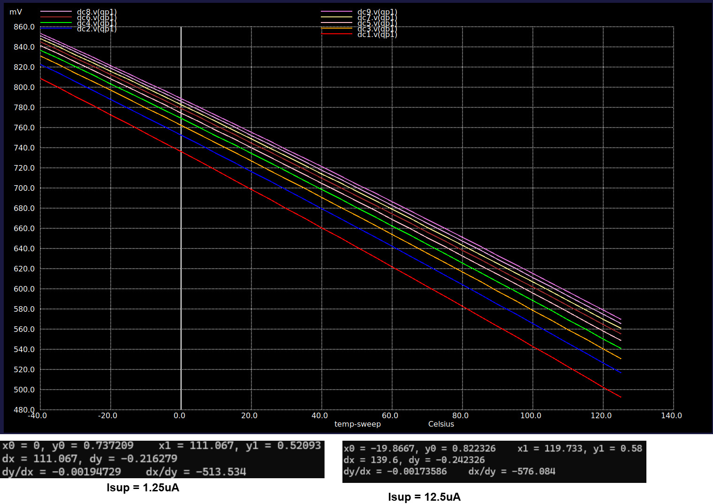 |
|:----------------------:|
| *Figure 3: CTAT voltage w.r.t temperature and load current. [Spice Netlist](../SpiceNetlists/CTAT_Circuit/ctat_circuit_sim_load.sp).* |

## PTAT Spice simulations

|  |
|:----------------------:|
| *Figure 4: PTAT circuit. [Spice Netlist](../SpiceNetlists/PTAT_Circuit/ptat_circuit.sp)* |

| 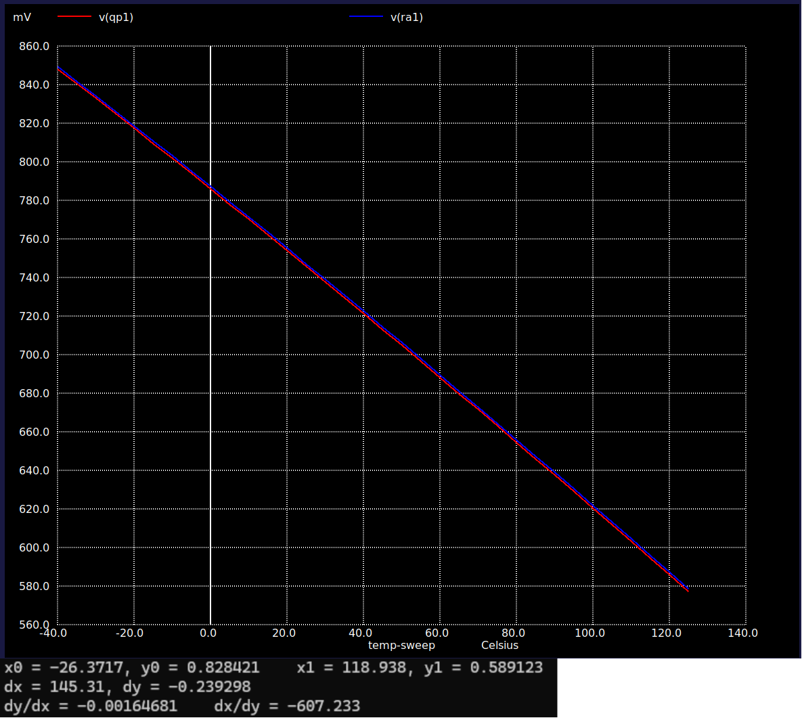 |
|:----------------------:|
| *Figure 5: V(qp1) & V(ra1) w.r.t temperature of the PTAT circuit. [Spice Netlist](../SpiceNetlists/PTAT_Circuit/ptat_circuit.sp)* |
* It can be seen that both qp1 and ra1 have the same nodal voltages. This is because the OP-AMP's input terminals are acting as a nullator to create a virtual short between qp1 and ra1.
* Node qp1 is actually a CTAT element in the PTAT circuit. We can therefore see a -ve temp coefficient in the above figure. 

|  |
|:----------------------:|
| *Figure 6: V(ra1)-V(qp2) w.r.t temperature i.e. the PTAT voltage in the PTAT circuit. [Spice Netlist](../SpiceNetlists/PTAT_Circuit/ptat_circuit.sp)* |
* The desired +ve temp coefficient, i.e., the +ve slope of the curve, can be seen in the above figure.

|  |
|:----------------------:|
| *Figure 7: V(qp1) & V(ra1) & V(ra1)-V(qp2) w.r.t temperature of the PTAT circuit. [Spice Netlist](../SpiceNetlists/PTAT_Circuit/ptat_circuit.sp)* |

| 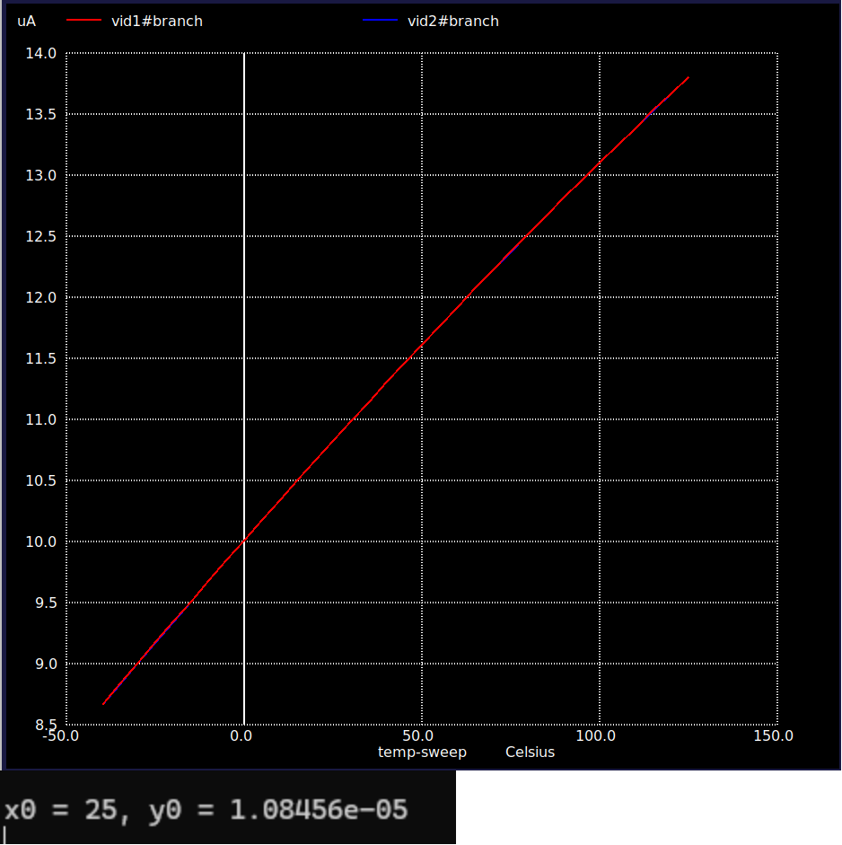 |
|:----------------------:|
| *Figure 8: Id1 & Id2 w.r.t temperature of the PTAT circuit. [Spice Netlist](../SpiceNetlists/PTAT_Circuit/ptat_circuit.sp)* |
* As shown in the figure, the branch current is =
* This is because the R1 is chosen to be 5kohms => I = Vt*ln(N)/R1 with N = 8 => I = 10uA. The simulation also matches our calculation.

## BGR with ideal OP-AMP Spice simulation

| 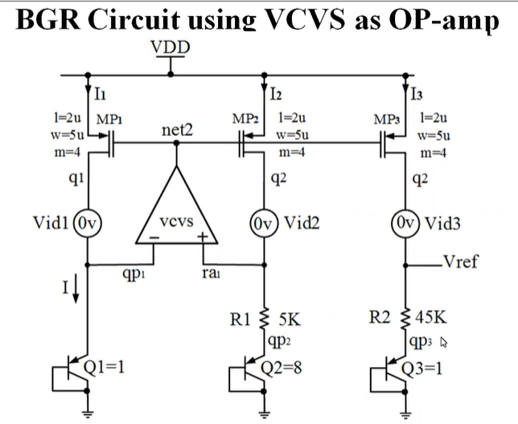 |
|:----------------------:|
| *Figure 9: BGR using an ideal opamp circuit. [Spice Netlist](../SpiceNetlists/BGR_using_ideal_OPAMP/bgr_using_ideal_opamp.sp)* |

| 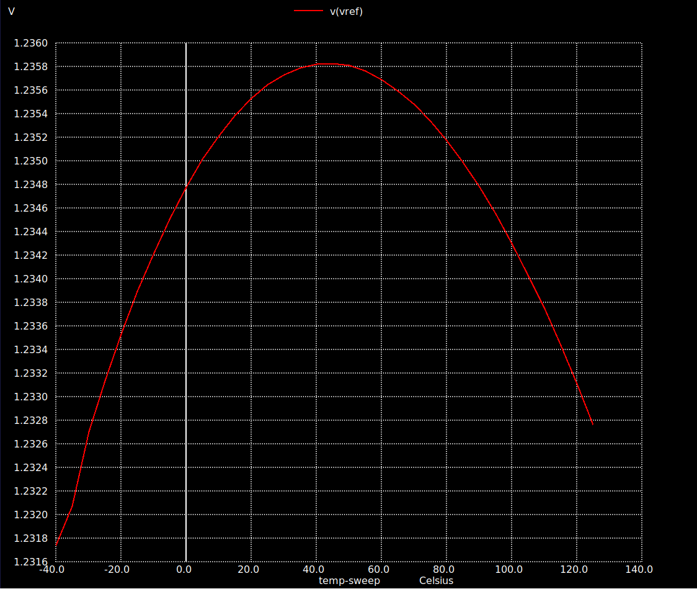 |
|:----------------------:|
| *Figure 10: BGR voltage given by the BGR circuit. [Spice Netlist](../SpiceNetlists/BGR_using_ideal_OPAMP/bgr_using_ideal_opamp.sp)* |
* It can be seen that across the whole temperature range, the BGR voltage changes by only a few ......

| 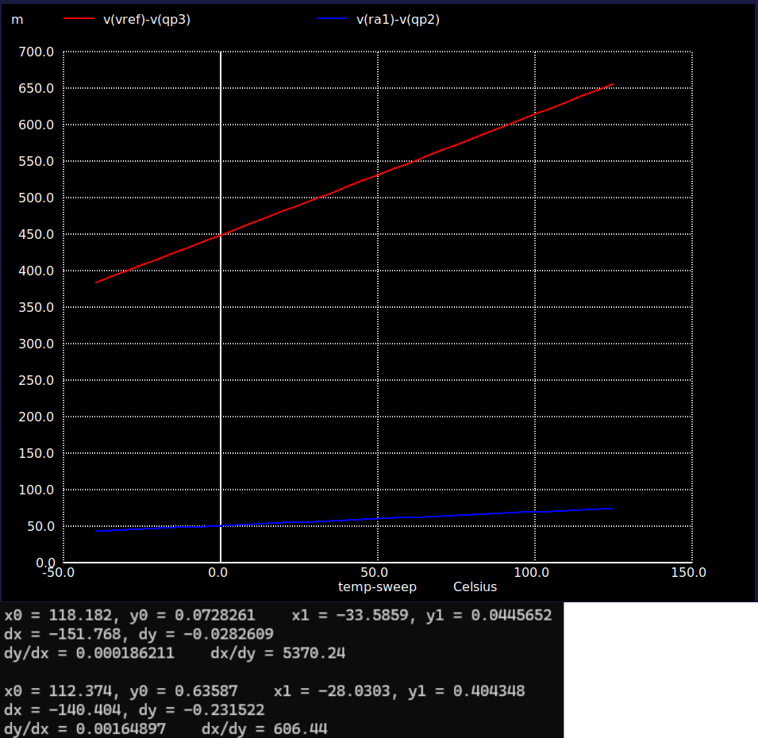 |
|:----------------------:|
| *Figure 11: V(vref)-V(qp3) & V(ra1) w.r.t temperature, i.e., the PTAT voltage and PTAT voltage before the 9x gain by R2 & R1. [Spice Netlist](../SpiceNetlists/BGR_using_ideal_OPAMP/bgr_using_ideal_opamp.sp)* |
* The desired +ve temp coefficient, i.e., the +ve slope of the curve, can be seen again in the above figure.

| 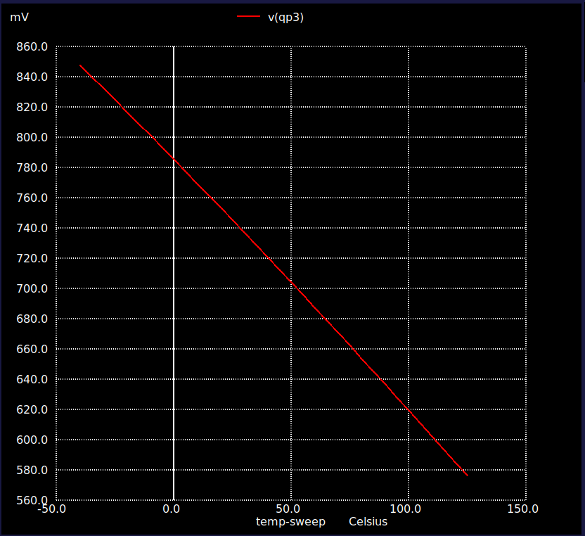 |
|:----------------------:|
| *Figure 12: V(qp3) w.r.t temperature, i.e., the CTAT voltage in the BGR circuit. [Spice Netlist](../SpiceNetlists/BGR_using_ideal_OPAMP/bgr_using_ideal_opamp.sp)* |
* The desired -ve temp coefficient, identical to the previous CTAT simulation, can be seen again in the above figure.

| 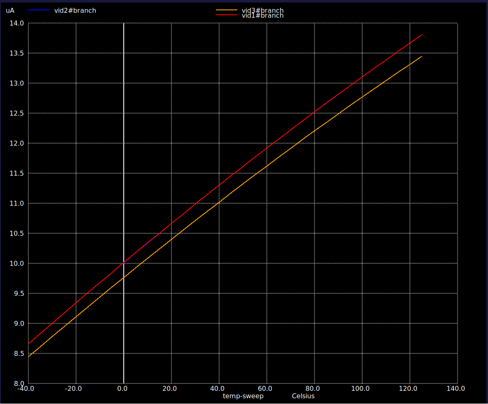 |
|:----------------------:|
| *Figure 13: Id1, Id2 & Id3 w.r.t temperature, i.e., the branch currents in the BGR circuit. [Spice Netlist](../SpiceNetlists/BGR_using_ideal_OPAMP/bgr_using_ideal_opamp.sp)* |
* The branch currents are again close to what was calculated.

| 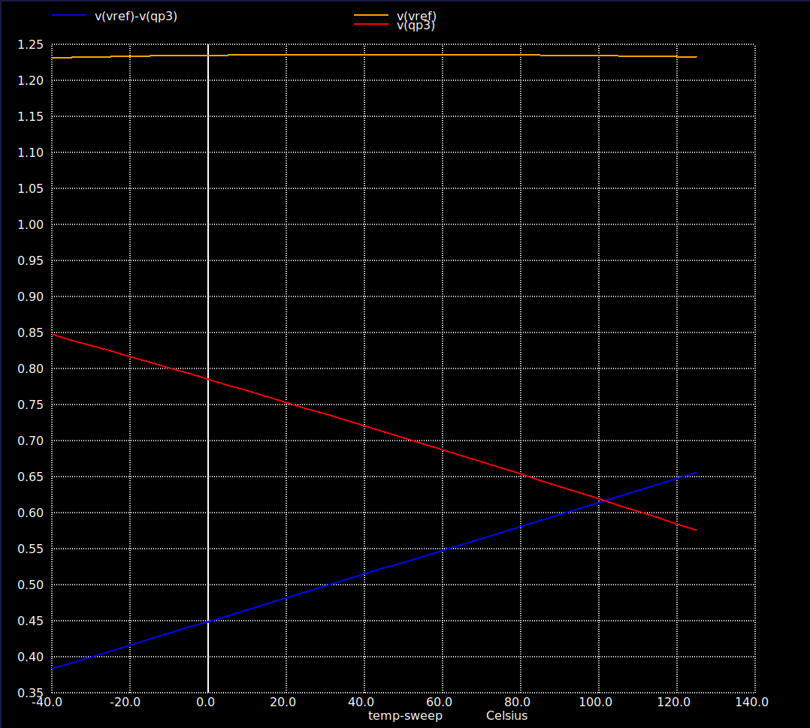 |
|:----------------------:|
| *Figure 14: BGR, PTAT & CTAT voltages w.r.t temperature. [Spice Netlist](../SpiceNetlists/BGR_using_ideal_OPAMP/bgr_using_ideal_opamp.sp)* |
* BGR is shown in , PTAT is shown, CTAT is shown in

## BGR Spice simulation

| 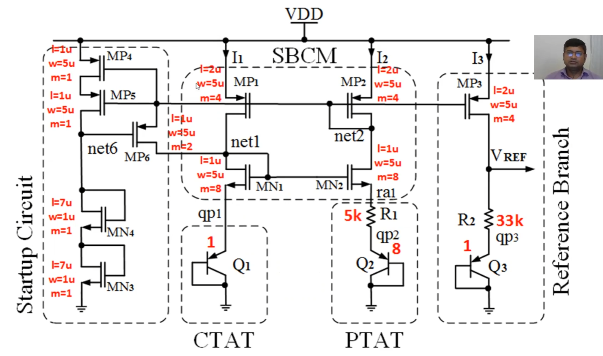 |
|:----------------------:|
| *Figure 15: BGR. [Spice Netlist](../SpiceNetlists/BGR/bgr.sp)* |

| 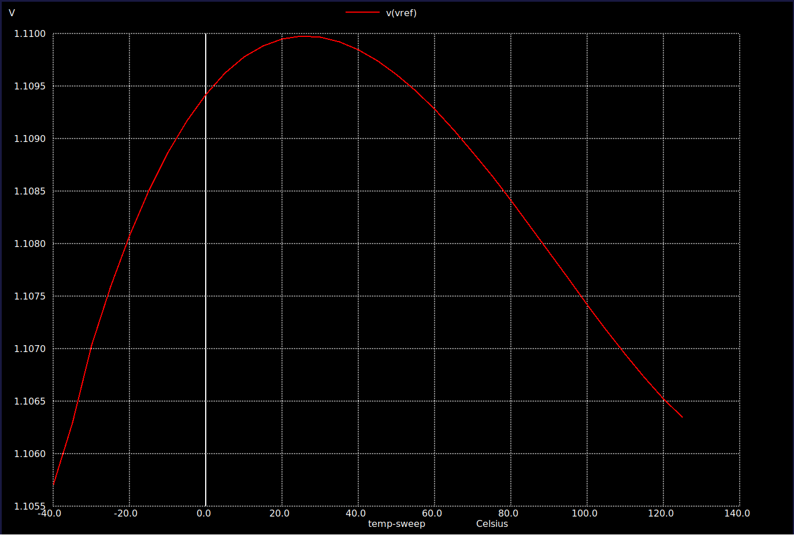 |
|:----------------------:|
| *Figure 16: BGR typical corner simulation. [Spice Netlist](../SpiceNetlists/BGR/bgr.sp)* |
