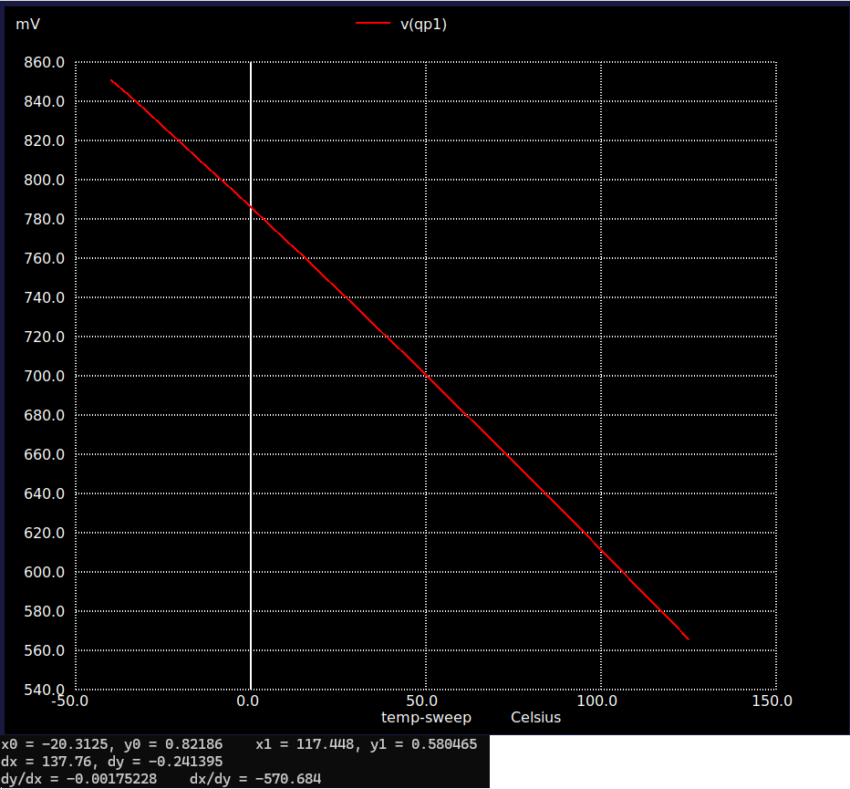
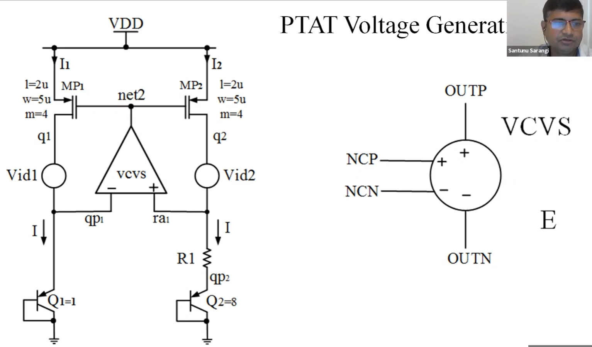

# Workshop Spice Simulation Results

## CTAT Spice simulations

[ctat_circuit_sim.sp](../SpiceNetlists/CTAT_Circuit/ctat_circuit_sim.sp)

|  |
|:----------------------:|
| *Figure 1: CTAT circuit simulations* |

## PTAT Spice simulations

[ptat_circuit.sp](../SpiceNetlists/PTAT_Circuit/ptat_circuit.sp)

|  |
|:----------------------:|
| *Figure 2: PTAT circuit* |

|  |
|:----------------------:|
| *Figure 3: V(qp1) & V(ra1) of PTAT circuit* |
* It can be seen that both qp1 and ra1 have the same nodal voltages. This is because the OP-AMP's input terminals are acting as a nullator to create a virtual short between qp1 and ra1.
* Node qp1 is actually a CTAT element in the PTAT circuit. We can therefore see a -ve temp coefficient in the above figure. 

|  |
|:----------------------:|
| *Figure 3: V(ra1)-V(qp2) i.e. the PTAT voltage in PTAT circuit* |
* The desired +ve temp coefficient can be seen in the above figure.
